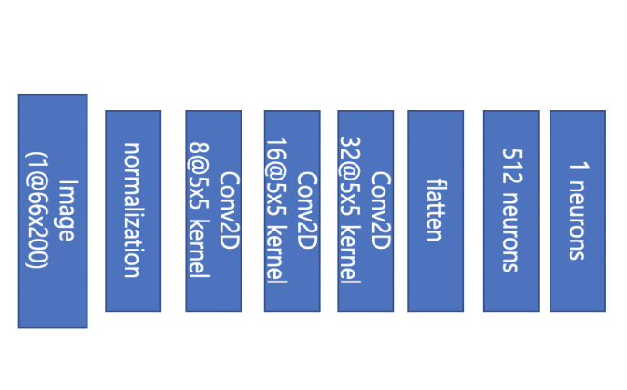

# end-to-end-learning-for-steering-angle

## Dataset  

* comma.ai driving dataset

## Environment

* Python 3
* Keras
* Google Colab
---

## Preprocess

```python3
    v1 : crop(160x320 to 90x300) -> resize(90x300 to 66x200) -> rgb2gray(3ch to 1ch)
```

---
## Network


---
## Result

---
### Reference

[1] https://github.com/commaai/research  
[2] https://images.nvidia.com/content/tegra/automotive/images/2016/solutions/pdf/end-to-end-dl-using-px.pdf
